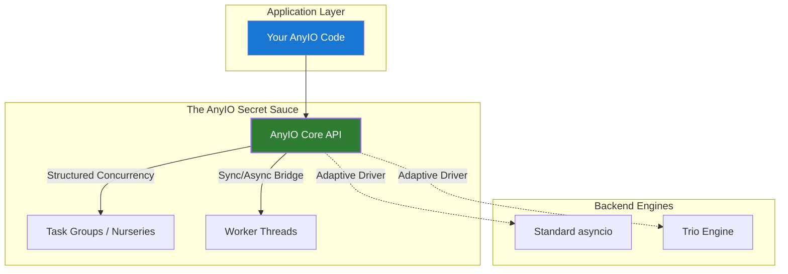
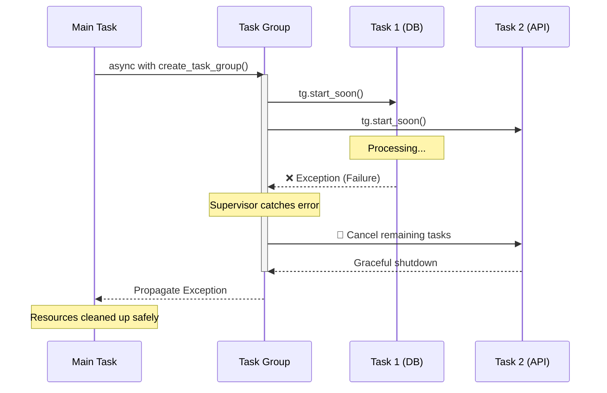

# The Hidden Secrets in Python: Making Your Program Really Efficient

If you’ve been building backends in Python, you’ve likely hit the "Async Wall." You want the speed of `asyncio`, but you’re tired of the boilerplate, the fragile event loops, and the struggle of making libraries play nice together. 

Enter **AnyIO**. 

Most developers think AnyIO is just another wrapper. It isn’t. It is the high-level engineering bridge that lets you write code that works on any asynchronous backend (asyncio or trio) while fixing the structural flaws of standard concurrency.

### **1. The Bottom-Up: Why do we care?**

To understand why AnyIO is a "secret weapon," we have to look at the stack:

*   **Sync (Synchronous):** The "one thing at a time" model. Your CPU sits idle while waiting for a database to respond. High latency, low throughput.
*   **Parallelism:** Running tasks on multiple CPU cores simultaneously. Great for heavy math, but overkill for most web I/O.
*   **Async (Asynchronous):** One core, many tasks. When one task waits for I/O, the loop switches to another. This is the heart of high-performance servers.
*   **Asyncio:** Python's built-in engine. It's powerful but notoriously "low-level" and easy to break if you don't handle task lifecycles perfectly.

### **2. The AnyIO Edge: Structured Concurrency**

The biggest secret in AnyIO is **Structured Concurrency**. In standard `asyncio`, you can "fire and forget" a task, but if it crashes or hangs, it becomes a zombie. 

AnyIO uses **Task Groups**. If one task in the group fails, they all get cleaned up. No leaked resources. No orphaned sockets. It forces you to write code that is clean by design.

### **3. Day-to-Day Usage: The Engineer's Toolkit**

AnyIO simplifies the complex. Instead of worrying about `loop.run_in_executor`, you use simple, readable primitives:

*   **Task Groups:** Run multiple async functions and wait for all to finish (or one to fail).
*   **Blocking Portal:** Call async code from sync code without losing your mind.
*   **Synchronization:** High-level Locks and Semaphores that actually behave predictably.

### **The "AnyIO Secret" Implementation**

Here is how you handle concurrent tasks like an engineer, ensuring that if your S3 upload fails, your Database cleanup still happens correctly.

```python
# --- THE ANYIO BLUEPRINT (PSEUDO-CODE) ---

import anyio

async def fetch_data(id):
    # Simulate I/O call
    await anyio.sleep(1)
    return {"id": id, "status": "ok"}

def heavy_sync_computation():
    # Simulate a CPU-bound or blocking call
    import time
    time.sleep(1)

async def process_heavy_payload():
    # 1. STRUCTURED CONCURRENCY: The Task Group
    # This ensures that if ONE task fails, the entire group is managed.
    results = []
    try:
        async with anyio.create_task_group() as tg:
            print("Starting concurrent operations...")
            
            # 2. SPARING TASKS: Non-blocking execution
            tg.start_soon(fetch_data, 1)
            tg.start_soon(fetch_data, 2)
            
            # 3. THREAD OFFLOADING: The AnyIO way
            # Need to do something sync (like heavy crypto or old SDKs)? 
            # AnyIO handles the thread pool for you.
            await anyio.to_thread.run_sync(heavy_sync_computation)

    except Exception as e:
        # 4. ERROR PROPAGATION: AnyIO catches issues across all tasks
        log_critical(f"Task group failed: {e}")
        raise

    # 5. RESULT: Clean exit, all tasks finished or cleaned up.
    print("All tasks verified and complete.")

# To run it on ANY backend (asyncio/trio):
# anyio.run(process_heavy_payload, backend="asyncio")
```

### **4. Pro Tips for Efficiency**

1.  **Stop using `asyncio.gather`:** It doesn't handle cancellations well. Use AnyIO Task Groups for better safety.
2.  **Use `anyio.to_thread`:** Don't manually manage `ThreadPoolExecutors`. AnyIO optimizes the thread count based on your system load.
3.  **Cross-Compatibility:** Writing a library? Use AnyIO. It ensures your users can run your code whether they prefer `asyncio` or `trio`.

### **Conclusion**

Efficiency isn't just about execution speed; it's about **reliability**. A program that crashes because of a leaked task isn't efficient—it's broken. 

AnyIO provides the high-level abstractions that turn "fragile" async code into "resilient" engineering. It’s the hidden secret that powers modern frameworks like **HTTPX** and **Starlette**. If you want to master the machine, you need to master the way tasks are grouped, managed, and executed.

---

## The Concurrency Evolution Stack

This diagram shows how AnyIO acts as a universal "Control Plane" over different backends, providing a consistent API for structured concurrency.



## The Lifecycle of a Task Group

This sequence diagram visualizes the "Shield" effect. It demonstrates how a Task Group supervises siblings and ensures no one is left behind when a failure occurs.
                


---

## References:
[Official AnyIO Documentation](https://anyio.readthedocs.io/en/stable/) <br/>
[Real Python: Async IO in Python](https://realpython.com/async-io-python/) <br/>
[Higher level Python asyncio with AnyIO - Talk Python to Me Ep.385](https://www.youtube.com/watch?v=o850tKba3lg&t=872s)
