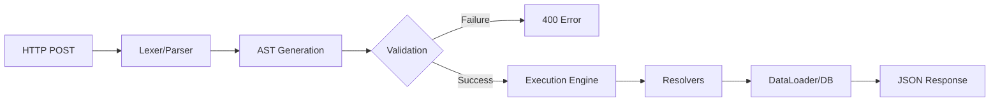

# The Modern GraphQL Stack: Engineering Type-Safe APIs with Strawberry

If you’re moving from [REST](https://www.rfc-editor.org/rfc/rfc9205.html) to [GraphQL](https://graphql.org/learn/), you’re moving from a **Resource-based** world to a **Graph-based** world. In REST, the URL is the boss. In GraphQL, the **Schema** is the boss. 

[Strawberry](https://strawberry.rocks/docs) is the modern Python engine that sits between your network and your data. It doesn't use "magic" class properties; it leverages the Python type system you already know to build a strictly validated execution tree.

### **1. The Protocol: No Magic, Just JSON over HTTP**

[GraphQL](https://rfcs.graphql.org/) is strictly an **Application Layer** concern. It doesn't invent a new networking layer; it usually rides on **HTTP/1.1 or HTTP/2**.

*   **The Single Endpoint:** You don't have `/api/users` and `/api/posts`. You have `/graphql`.
*   **The Method:** Almost everything is a **POST**. You are sending a JSON payload that contains a `query` string and an optional `variables` object.
*   **The Conversation:** The client sends a string; the server validates it against your Python types and returns a JSON response that mirrors the request's shape exactly.


### **2. The Internal "Meat": Lexing and Execution**

When a request hits your Strawberry server, it goes through a meat-grinder of processing before a single line of your business logic runs:

1.  **Lexical Analysis:** The engine breaks the query string into tokens.
2.  **AST Generation:** It builds an **Abstract Syntax Tree (AST)**—a nested object representing the client's request.
3.  **Validation:** Strawberry compares the AST to your Python `@strawberry.type` classes. If the client asks for `user_id` but your class defines it as `id`, the server kills the request with a `400 Bad Request` before the database is even touched.
4.  **Field Resolution:** This is the execution phase. The engine walks the tree and calls a "Resolver"—the Python function that knows how to get that specific piece of data.

### **3. Strawberry Architecture: Types vs. Resolvers**

In Strawberry, you define the **Contract** (the Type) and the **Logic** (the Resolver). This separation is what makes the system scale.

```python
import strawberry
from typing import List

# THE CONTRACT: What can the client see?
@strawberry.type
class Post:
    id: strawberry.ID
    title: str
    content: str

# THE LOGIC: How do we actually get the data?
async def get_latest_posts() -> List[Post]:
    # This is the "Meat." You talk to Postgres/Redis here.
    # SELECT * FROM posts LIMIT 10
    raw_data = await db.execute("SELECT * FROM posts LIMIT 10")
    return [Post(**row) for row in raw_data]

@strawberry.type
class Query:
    # We map the field 'latestPosts' to the 'get_latest_posts' function
    latest_posts: List[Post] = strawberry.field(resolver=get_latest_posts)

schema = strawberry.Schema(query=Query)
```

### **4. Performance Meat: Batching and DataLoaders**

The biggest technical trap in GraphQL is the **N+1 Problem**. If a client asks for 10 posts and their authors, a naive implementation will run 1 query for the posts, and then 10 separate queries for each author.

**The Solution: DataLoaders.**
Strawberry provides a `DataLoader` [class](https://strawberry.rocks/docs/guides/dataloaders). Instead of your resolver hitting the DB immediately, it "defers" the work. Strawberry collects all the requested IDs, batches them, and sends **one** single `SELECT ... WHERE id IN (1, 2, 3...)` query. This is non-negotiable for production-grade engineering.

### **5. Why Strawberry is the Engineer's Choice**

*   **Zero Redundancy:** You use standard Python `dataclasses` and **Type Hints**. No custom "Graphene-style" objects.
*   **Async Native:** Built from the ground up for `asyncio`. It handles concurrent field resolution out of the box.
*   **Pydantic Integration:** It can convert Pydantic models directly into GraphQL types, keeping your data validation in one place.

### **Conclusion**

GraphQL with Strawberry isn't about "better" APIs; it's about **reducing friction**. It moves the burden of data shaping from the Backend Engineer to the Frontend Engineer, while keeping everything strictly typed and validated. 

If your frontend is a simple script, stick to REST. If your frontend is a complex React/Vue app, **Strawberry is the move.**

---

## The Execution Flow

This diagram visualizes how Strawberry transforms a raw HTTP string into a typed Python response.



---

## References:
[Official Strawberry Documentation](https://strawberry.rocks/docs) <br/>
[Strawberry GitHub Repository](https://github.com/strawberry-graphql/strawberry) <br/>
[DataLoader Pattern by Meta](https://github.com/graphql/dataloader) <br/>
[PyCon Italia Strawberry Fields Forever: Enjoy building GraphQL Web APIs - Jonathan Marcel Ehwald](https://www.youtube.com/watch?v=12Lxsvyi7n0)
