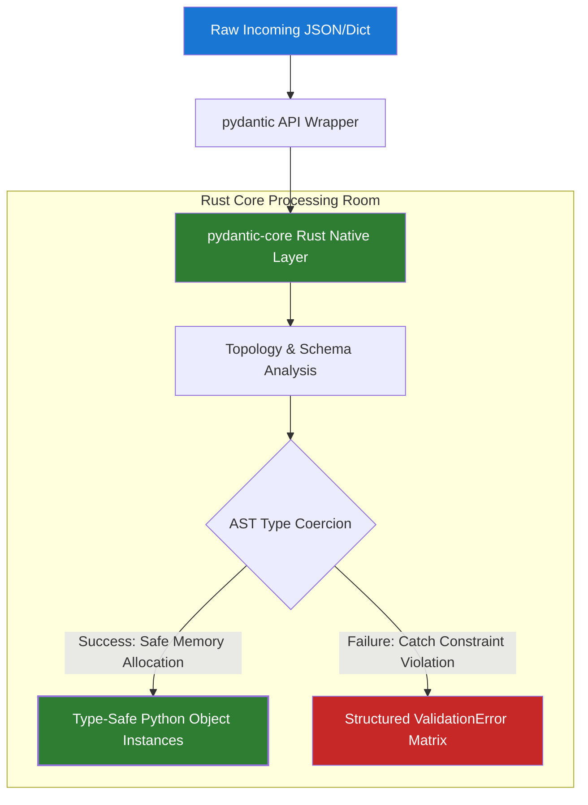

# The Pydantic Engine: Deep-Dive into Performance, Rust Core, and Enterprise Architecture

In modern backend engineering, data validation is often treated as a secondary concern-a tedious layer of if/else boilerplate tucked away behind HTTP routing code. But in high-throughput, mission-critical systems, validation is the literal gatekeeper of your application state.

Python is inherently dynamic. It treats data types as hints, not hard constraints. When untrusted JSON strings cross the network boundary into your runtime, you need an absolute guarantee that they conform to your application's expectations before they hit your database or memory store.

For millions of production systems, that guarantee is delivered by **Pydantic**.

But to treat Pydantic as just a simple "validation library" misses the entire architectural shift it represents. Let's peel back the layers and analyze how this engine actually processes data under the hood.

---

### 1. The Genesis: Why Python Needed a Parser

Before Pydantic, data validation in Python was fragmented, slow, and brittle. Developers relied heavily on manual runtime inspections, complex regex wrappers, or schema definition layers like marshmallow. These tools had a fundamental design flaw: they focused on *validation instead of parsing*.

In [2017](https://github.com/pydantic/pydantic/releases/tag/v0.0.2), **Samuel Colvin** created Pydantic to change that paradigm.

The core philosophy of Pydantic is a direct nod to the classic engineering maxim: *Be conservative in what you send, be liberal in what you accept.* Pydantic does not merely throw an exception when an incoming variable looks slightly wrong; it **coerces** it.

> **Parsing, Not Validation:** If you define a field as an integer (int), and a client hits your endpoint with the string "2026", a pure validator fails. Pydantic, acting as a parser, evaluates the payload, guarantees it safely represents an integer, converts it to the native CPU primitive 2026, and drops it cleanly into memory.

---

### 2. The Architectural Shift: The V2 Rust Engine

Later, Pydantic had become the backbone of modern Python frameworks like **FastAPI**. However, it hit a hard ceiling: the Python runtime interpreter itself. Traversing deeply nested JSON dictionaries, initializing hundreds of thousands of pure Python classes per second, and checking type objects introduces heavy CPU overhead.

To break through this performance wall, Colvin executed a scorched-earth rewrite for **Pydantic V2**. He tore out the pure Python execution layer and replaced it completely with **Rust**.

The architecture was split into two completely decoupled layers:

1. [pydantic-core](https://github.com/pydantic/pydantic/tree/main/pydantic-core): A high-performance validation and parsing engine written in Rust. It operates directly on Python objects via PyO3, compiling down to native machine code. It handles all dictionary traversal, string matching, and type coercion at raw C-speeds.
2. pydantic: The clean, elegant, and idiomatic Python interface that developers use day-to-day.

By offloading the heavy algorithmic sorting to Rust, Pydantic achieved a **4x to 50x speedup** in serialization and parsing execution. It transformed Python's biggest weakness-slow CPU bound computation-into a highly optimized native pipeline.

```python
from pydantic import BaseModel, Field, EmailStr

# This standard Python declaration compiles into an ultra-fast 
# Rust validation schema under the hood at runtime initialization.
class SystemConfiguration(BaseModel):
    node_id: int
    cluster_name: str = Field(min_length=4, max_length=32)
    admin_email: EmailStr
    metrics_enabled: bool = True

```

---

### 3. Anatomy of a ValidationError

When input data fails to match your system contract, Pydantic throws a [ValidationError](https://pydantic.dev/docs/validation/latest/errors/validation_errors). In an enterprise backend, raw text stack traces are useless. Your upstream services, API gateways, and client applications need to know exactly *what* failed, *where* it failed, and *why* it failed, without parsing human text.

[Pydantic V2](https://pydantic.dev/articles/pydantic-v2-final) standardized this by implementing machine-readable **Error Type Groups**.

When a payload fails validation, the Rust core generates a collection of precise error dictionaries, entirely bypassing expensive string generation until requested.

#### Core Error Type Matrix

| Error Type Group | Engine Code | Core Trigger Mechanic |
| --- | --- | --- |
| **Structural Failures** | missing, extra_forbidden | The payload topology does not match the schema contract (e.g., missing required fields). |
| **Type Coercion Failures** | int_parsing, bool_parsing | The data type cannot be safely converted to the target primitive without data loss. |
| **Boundary Bounds Violations** | greater_than, string_too_short | The type is correct, but the value falls outside specified architectural or business limits. |
| **Semantic Failures** | email_type, url_parsing | Complex syntax validations (e.g., strings failing standard RFC syntax rules). |

#### Programmatic Deconstruction of Failures

Instead of treating exceptions as strings, you call .errors() to dump the structured error state directly out of the engine:

```python
from pydantic import ValidationError

invalid_payload = {
    "node_id": "malicious-string-instead-of-int",
    "cluster_name": "us",  # Too short
    "admin_email": "broken-email-format"
}

try:
    SystemConfiguration(**invalid_payload)
except ValidationError as e:
    # Extracts the exact programmatic error payload array from the Rust core
    error_matrix = e.errors()

```

The engine outputs a precise, clean JSON array mapping the exact path to the error:

```json
[
  {
    "type": "int_parsing",
    "loc": ["node_id"],
    "msg": "Input should be a valid integer, unable to parse string as an integer",
    "input": "malicious-string-instead-of-int"
  },
  {
    "type": "string_too_short",
    "loc": ["cluster_name"],
    "msg": "String should have at least 4 characters",
    "input": "us"
  }
]

```

---

### 4. The Capital Expansion: Pydantic Inc. and the Modern Ecosystem

Pydantic's critical role in production backends transformed it from a niche open-source project into a heavily backed enterprise company. In [2023](https://techcrunch.com/2023/02/16/sequoia-backs-open-source-data-validation-framework-pydantic-to-commercialize-with-cloud-services/), Samuel Colvin raised a **$4.7 million seed round** led by Sequoia Capital to found **Pydantic Inc.** This was rapidly followed in early [2024](https://techcrunch.com/2024/10/01/sequoia-backs-pydantic-to-expand-beyond-its-open-source-data-validation-framework/) by a **$12.5 million Series A** led by Lightspeed Venture Partners.

This injection of venture capital shifted Pydantic from a library into an expansive, cloud-scale developer tooling ecosystem. The company leveraged its underlying validation technology to launch two major enterprise platforms:

* **PydanticAI:** A production-grade [framework](https://pydantic.dev/docs/ai/overview/) engineered for agentic AI applications. Large Language Models (LLMs) are notoriously non-deterministic, frequently outputting chaotic text strings. PydanticAI forces LLM outputs to parse directly into strict, typed Pydantic structures, providing reliable type safety to AI engineering.
* **Pydantic Logfire:** A high-performance [observability and telemetry engine](https://pydantic.dev/docs/logfire/get-started/#_top). Instead of sifting through massive walls of unstructured unstructured strings, Logfire hooks into your Pydantic data layers to track, profile, and visualize exactly how your data alters shape as it mutates through your backend services.

By monetizing these developer platforms via enterprise SaaS models, Pydantic Inc. has secured permanent financial backing for the core library, ensuring that Python's most vital parsing layer remains highly maintained, optimized, and fast.

---

## The Core Parsing Lifecycle

This diagram shows the execution loop of data passing through Pydantic's architectural boundaries, moving seamlessly from untrusted network dictionaries to validated machine memory blocks.


