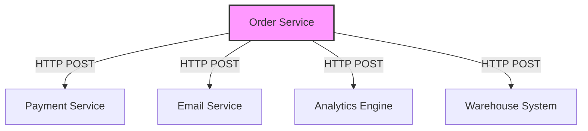
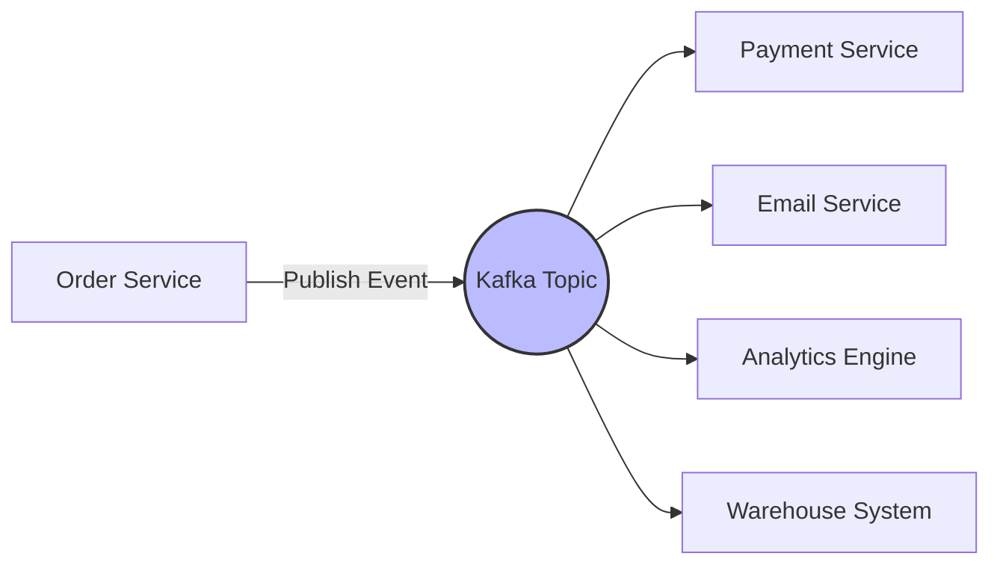
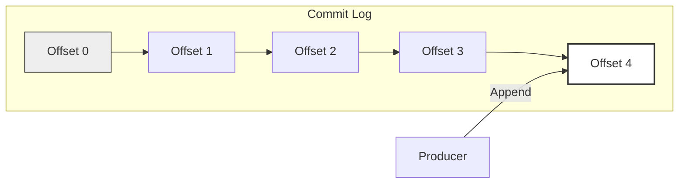
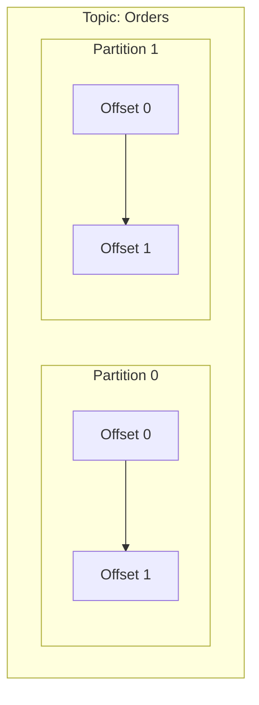
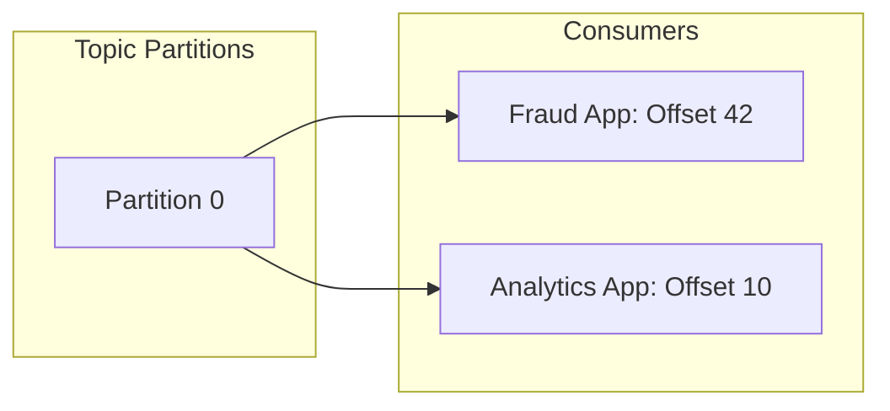
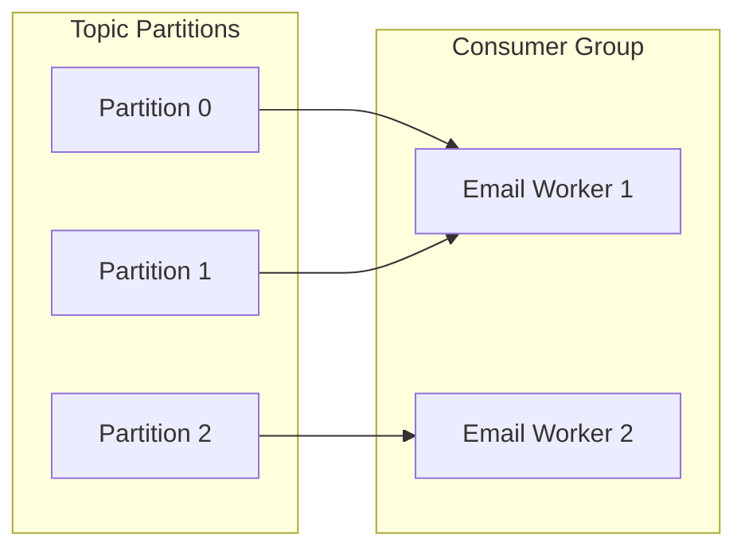
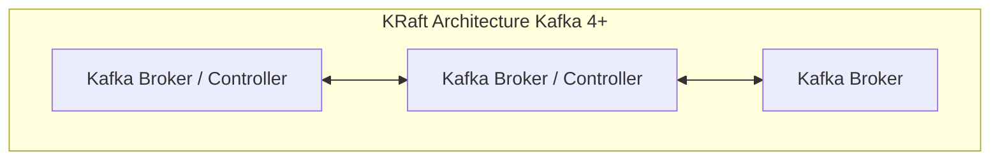

# Rethinking System Architecture: Why Apache Kafka is More Than Just a Message Queue

We’ve all built or seen this setup. You run a standard web app, and behind it, a bunch of services need to react to a single user action[cite: 1]. Take a basic e-commerce platform: a customer clicks "Place Order". Suddenly, a heavy chain reaction kicks off-you need to hit a payment service, trigger a confirmation email, ping analytics, update the warehouse shipping system, and run fraud checks.

For a small system, the obvious play is to just wire them together with direct HTTP or gRPC calls. When an order hits, the order service calls payment, then email, then analytics. If your app is small, this is totally fine-don't over-engineer it. 



But things start breaking as you grow. Your core order service slowly turns into a massive hub that every other team wants to plug into. Every time someone builds a new feature that needs order data, they ask you to add one more API call to your code.

Worse, you run into messy runtime issues:

* **Cascading Failures:** If the email service goes down, should the entire checkout flow fail?
* **Latency Accumulation:** If analytics runs slow, why should a customer wait 3 extra seconds for a response that has nothing to do with their actual transaction?
* **Unbuffered Traffic Spikes:** The moment you hit a traffic spike, every downstream service gets slammed at the exact same second because there is nothing in between to absorb the hit.

What you actually want is for the order service to just announce that an order happened, and immediately go back to its own business. Anyone interested can deal with that event on their own time. This is exactly why Kafka was built.



---

### The Core Concept: The Commit Log

People always compare Kafka to traditional message queues like [RabbitMQ](https://www.rabbitmq.com/), but the underlying data model is completely different.

A normal message queue acts like a meticulous accountant-tracking every message for every single consumer, remembering what got delivered, and what got acknowledged. This per-message bookkeeping creates a massive performance bottleneck.

Kafka strips all of that away for a dead-simple abstraction: **an append-only commit log**.



When a producer sends an event, Kafka just writes it to the very end of a file on disk and stamps it with a number called an **offset**. Events pile up in the exact order they arrive: oldest at the front, newest at the back.

The critical thing to understand here: **the data is 100% immutable**. Kafka never goes back to rewrite something in the middle, and it never deletes a message just because a consumer read it. Messages stay there based on a retention window you set (like 7 days) or a size limit, completely ignoring whether consumers are done with it or not.

---

### Scaling Out: Topics and Partitions

A stream of events (like all your orders) is called a **Topic**. Since a single topic can quickly grow too big for one machine, Kafka breaks it down into smaller chunks called **Partitions**. This lets Kafka spread the data across multiple machines under the hood.



#### Keeping Things in Order

Here is the catch: Kafka only promises strict ordering **within a single partition**. If you need all events for a specific order ID to be processed in sequence, they must land in the exact same partition.

To handle this, every event you send has a **Value** (the payload) and a **Key** (like the `order_id`).

```python
Event = { Key: "order_1042", Value: { ... } }

```

When an event comes in, Kafka takes the key, hashes it, and uses that number to pick the destination partition. Because the same key always hashes to the same partition, all events for `order_1042` land in the exact same log chunk, keeping your execution order perfectly intact.

> ⚠️ **The Partitioning Trap:** This works flawlessly as long as your partition count stays the same. If you add partitions to a topic later, the hash calculation changes and your keys will suddenly land somewhere else, completely breaking your ordering. That's why teams usually over-provision partition counts right from day one.

---

### High-Performance Reads: Offsets and Consumer Groups

Since Kafka doesn't delete messages when they're read, how do consumers track what they've processed?

The consumer handles its own progress tracking by keeping a single number: its current **offset** position in the log. Every now and then, it commits this number back to Kafka, which saves it in a tiny internal topic. If your consumer crashes or restarts, it grabs its last saved offset and picks up exactly where it left off.



This setup unlocks two massive superpowers:

1. **Total Consumer Independence:** Different systems can read the exact same data stream at completely different speeds without touching each other. Your fraud detection app can read an order the millisecond it happens, while your analytics pipeline reads those same orders 3 days later for a report.
2. **Data Replay (Time Travel):** Did you ship a bad bug to production and need to reprocess last week's data? No need to mess with database backups. Just roll your consumer’s offset backward in time and read the immutable log again.

#### Parallelism via Consumer Groups

To scale up your read throughput, you use **Consumer Groups**-a bunch of instances working together on the same topic.

Inside a group, Kafka ensures a strict rule: **each partition goes to exactly one consumer instance**.



* If you have 6 partitions and 3 consumers, each consumer takes 2 partitions.
* If you scale up to 6 consumers, Kafka shifts things around so everyone gets 1 partition.
* If you spin up 10 consumers for 6 partitions, 4 of them will sit idle doing nothing. You can never have more active consumers than partitions.

This partition locking is great for avoiding race conditions. If your email service gets hit with a massive spike, you can spin up a duplicate copy to handle the load. If they both read randomly, your customer gets two duplicate confirmation emails. By throwing them into the same Consumer Group, Kafka cuts the work up cleanly so each message is handled exactly once.

---

### Built for Speed and Resilience

Writing everything straight to disk sounds like it would be incredibly slow, but Kafka gets around disk bottlenecks with some smart low-level engineering.

#### Why it's fast:

* **Sequential Writes:** Random disk access kills performance because the drive head has to jump around. Kafka only appends to the very end of a log file, which is a sequential write-something modern hardware handles incredibly fast.
* **Page Cache Exploitation:** Kafka uses the host OS page cache heavily. Freshly written data stays in system memory. When a fast consumer comes along to read it, Kafka serves it straight from RAM, skipping physical disk reads entirely.
* **Zero-Copy Optimization:** Normally, apps copy data from kernel space to user space, then back to the network socket. Kafka triggers a Zero-Copy system call (`sendfile`). The bytes go directly from the page cache to the network socket without ever touching Kafka’s application memory, saving massive CPU cycles.

#### Fault Tolerance

To survive hardware crashes, partitions are copied across multiple brokers (servers). For each partition, one broker is the **Leader** and the others are **In-Sync Replicas (ISRs)**.

Producers and consumers talk directly to the Leader. If that machine dies, one of the ISRs is instantly promoted to take over, and your code just keeps running like nothing happened.

---

### Architectural Evolution: Dropping Zookeeper

Running a distributed cluster means you need a way to keep track of metadata-which brokers are up, and who is leading which partition.

For years, Kafka handed this job off to an external tool called [Apache ZooKeeper](https://zookeeper.apache.org/). While it worked, ZooKeeper added serious deployment overhead, cluster complexity, and sync bottlenecks at high scale.

With **Kafka 4**, ZooKeeper is completely gone.

The cluster now handles its own metadata natively using **KRaft (Kafka Raft)**, a built-in consensus protocol. Moving metadata into the log engine itself means Kafka 4 gives you faster controller failovers, way simpler deployments, and better scaling limits. You can check the details out in the official [Apache Kafka documentation](https://kafka.apache.org/).



---

### Summary

Strip away the marketing, and Kafka is just a highly optimized, distributed, append-only log. Instead of tangling your microservices in a messy web of direct API requests, you drop an event into the stream and move on. The rest of your system consumes it whenever it's ready.
