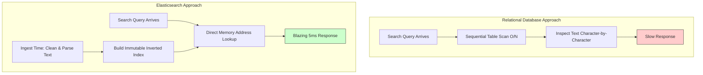
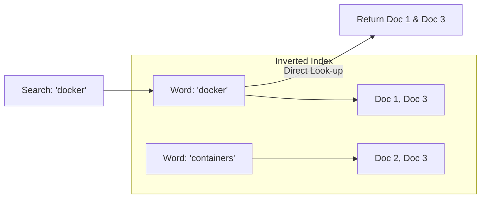
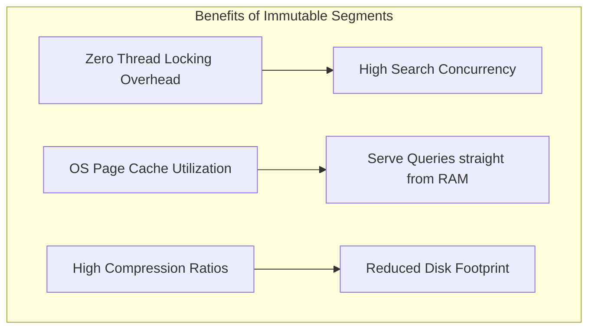
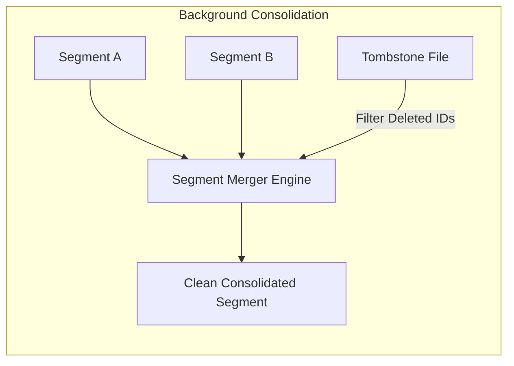
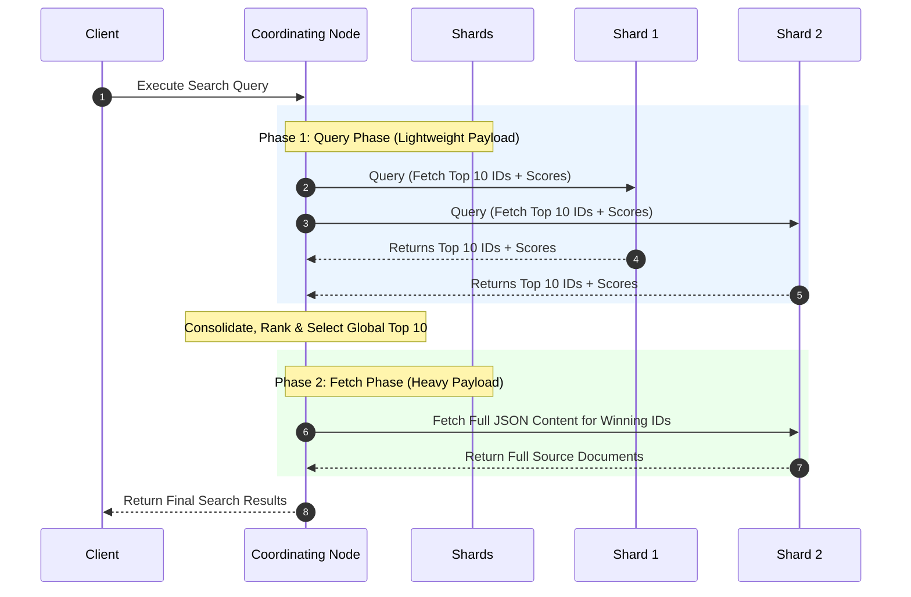
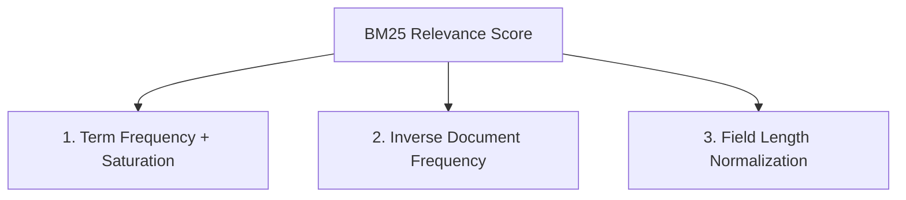

# How Elasticsearch Searches Billions of Documents in 5ms

Suppose you run a standard [SQL](https://www.postgresql.org/) query like `WHERE content LIKE '%postgres%'` across a massive table with 100 million rows[cite: 1]. You hit enter, and then you wait[cite: 1]. 

The database engine has to pull every single record into memory and inspect the text character by character to find a match[cite: 1]. It’s a classic $O(N)$ full table scan-the more logs or articles you store, the slower your app gets[cite: 1].

So how does a search engine like [Elasticsearch](https://www.elastic.co/elasticsearch/) query a dataset 100 times larger-say, a billion documents-and give you back the exact matches with relevance scores in 5 milliseconds[cite: 1]?

The core trick isn't some magic query-time optimization. **It's that Elasticsearch does all the hard math when you index the data, not when you search it[cite: 1].**



Elasticsearch doesn't actually handle the raw indexing or searching logic itself. Under the hood, it offloads all low-level text processing to [Apache Lucene](https://lucene.apache.org/). Elasticsearch is essentially a distributed orchestration wrapper built on top of Lucene to handle horizontal scaling, sharding, and network routing.

Let’s peek under the hood to see how it actually executes queries at speed.

---

### Step 1: Inverting the Data Model

Relational databases organize storage around the record ID. Row `#101` holds a user ID, a timestamp, and a big blob of text. The database engine has no idea what words are inside that text blob until it parses it.

Lucene completely flips this around. Instead of pointing **Document IDs $\rightarrow$ Words**, it maps **Words $\rightarrow$ Document IDs**. This data structure is known as an [Inverted Index](https://www.elastic.co/docs/manage-data/data-store/text-analysis/index-search-analysis).



Imagine we ingest three technical log entries:

* **Doc 1:** `"deploying docker service"`
* **Doc 2:** `"running app containers"`
* **Doc 3:** `"docker containers restarted"`

Instead of storing these as three separate isolated rows, the engine parses them into a lookup table of unique words:

* The word `docker` points straight to `[Doc 1, Doc 3]`.
* The word `containers` points straight to `[Doc 2, Doc 3]`.

This lookup array is called a **Postings List**. But a postings list stores much more than just a raw list of document IDs:

1. **Term Position:** The exact offset/position of the word in the sentence (crucial for exact-phrase queries like `"docker containers"` where words must be adjacent).
2. **Term Frequency (TF):** How many times the word appears in that document (used to score how relevant the document is).

When you search for `docker`, Elasticsearch doesn't open the documents or read text strings. It jumps straight to the term dictionary in memory, grabs the postings list for `docker`, and immediately knows which documents match.

The lookup speed isn't bound by the size of your cluster; it only depends on how many documents actually contain that specific word.

> ⚖️ **The Storage Trade-Off:** Speed isn't free. Building inverted indexes, storing positions, and indexing term frequencies means you trade cheap disk space for query speed. An index with positions enabled can add **40% to 80% storage overhead** on top of the raw source data.

---

### Step 2: Normalizing Text via the Analyzer Pipeline

There's an obvious flaw with naive word matching. Doc 2 contains `"containers"` (plural), while Doc 3 contains `"container"` (singular). If a user queries `"container"`, they expect to see both logs.

To solve this, Elasticsearch passes every incoming text string through an [Analyzer Pipeline](https://www.elastic.co/docs/manage-data/data-store/text-analysis/configure-text-analysis) before anything gets written to disk.


The pipeline processes text in three sequential steps:

* **[Character Filters](https://www.elastic.co/docs/reference/text-analysis/character-filter-reference):** Cleans up the raw string (e.g., stripping out HTML, converting symbols like `&` to `and`).
* **[Tokenizer](https://www.elastic.co/docs/reference/text-analysis/tokenizer-reference):** Breaks the clean string into discrete tokens, usually splitting along whitespace or punctuation boundaries.
* **[Token Filters](https://www.elastic.co/docs/reference/text-analysis/token-filter-reference):** Modifies those tokens. It lowercases every character, drops common noise words (`is`, `the`, `at`), and passes terms through a [Stemmer](https://www.elastic.co/docs/manage-data/data-store/text-analysis/stemming). A stemmer strips suffixes so that `containers`, `containerized`, and `containment` all reduce down to the core root `contain`.

You can actually inspect this pipeline yourself using Elasticsearch's built-in [`_analyze` API](https://www.elastic.co/docs/api/doc/elasticsearch/operation/operation-indices-analyze):

```json
POST /_analyze
{
  "analyzer": "standard",
  "text": "The <b>Docker</b> containers restarted!"
}

```

The engine turns that messy raw string into a clean array of indexed tokens:

```json
{
  "tokens": [
    { "token": "docker", "start_offset": 7, "end_offset": 15, "position": 1 },
    { "token": "containers", "start_offset": 20, "end_offset": 30, "position": 2 },
    { "token": "restarted", "start_offset": 31, "end_offset": 40, "position": 3 }
  ]
}

```

> **Crucial Rule:** The exact same analyzer configured for your index must also process your query at search time. If a user searches for `"CONTAINERS"`, the query analyzer lowercases and stems it to `contain`, instantly hitting the exact same token created when the data was ingested weeks ago.

---

### Step 3: Fast Writes & Immutable Segments

Once Lucene normalizes the tokens, it writes them into disk structures called **Segments**. An index isn't one giant monolithic file-it’s composed of multiple independent segments stacked together.

The defining architectural property of a segment is that **it is 100% immutable**. Once written to disk, it is never updated or modified.



Immutability gives you massive speed advantages:

* **No Lock Contention:** Hundreds of read threads can query the exact same segment simultaneously without needing database locks.
* **Aggressive OS Memory Caching:** Because segment data on disk never goes stale, the operating system can aggressively cache segments in RAM. Subsequent searches read straight from RAM, bypassing physical disk I/O entirely.

#### Handling Deletions and Updates

If segments can't be modified, how do you delete or edit data?

When you delete a document, Elasticsearch writes its ID to a lightweight `.del` file called a **Tombstone**. During a search, Lucene retrieves matching documents from the segment as usual, but filters out any IDs flagged in the tombstone file before returning the final payload.

To prevent disk bloat, Elasticsearch runs a background [Segment Merge](https://www.elastic.co/docs/api/doc/elasticsearch/operation/operation-indices-forcemerge) process. It periodically grabs several smaller segments, purges any document IDs marked in the tombstone files, and writes a single, freshly optimized, consolidated segment to disk.



---

### Step 4: Distributed Scaling (Shards & Scatter-Gather)

All of the segment logic above happens on a single Lucene core. To scale to terabytes or petabytes of data, Elasticsearch distributes an index across multiple [Primary Shards](https://www.google.com/search?q=https://www.elastic.co/docs/reference/elasticsearch/index-modules/indexing-buffer) hosted on different physical machines (nodes).

#### Routing Incoming Documents

When you index a document, Elasticsearch determines which shard owns it using a simple hash calculation:

$$\text{Shard ID} = \text{hash}(\text{document\_id}) \pmod{\text{number\_of\_primary\_shards}}$$

#### Executing Distributed Searches (Scatter-Gather)

Because your data is split across multiple machines, a search query usually has to consult every shard. You can send your search request to *any* node in the cluster, and that node temporarily steps up as the **Coordinating Node**.



The distributed search runs in two distinct phases to keep network traffic minimal:

1. **The Query Phase:** The coordinating node scatters the query to every shard in the index. Each shard executes the search locally against its Lucene segments, picks its top 10 matching document IDs alongside their mathematical relevance scores, and sends *only* those IDs and scores back.
2. **The Fetch Phase:** The coordinator merges the lists from all shards, sorts them globally, and picks the absolute top 10 winners. It then reaches back out *only* to the specific shards holding those 10 winning IDs to fetch their full `_source` JSON document bodies, assembling the final HTTP response for the client.

---

### Step 5: Ranking Matches with Okapi BM25

Finding matching documents is only half the problem-you need to surface the most relevant results at the top. Elasticsearch ranks results using the [Okapi BM25](https://www.elastic.co/docs/reference/elasticsearch/mapping-reference/similarity) scoring algorithm, which evaluates three main metrics:



* **Term Frequency (TF) & Saturation:** The more times a search term appears in a document, the higher its relevance score. However, BM25 applies *saturation*: the jump from 1 occurrence to 2 gives a big score boost, but the jump from 20 to 21 adds almost nothing. This prevents keyword-stuffed documents from manipulating results.
* **Inverse Document Frequency (IDF):** If a search query contains common words like `app` or `log`, those words appear everywhere, so matching them doesn't mean much. But if a query contains a rare term like `out-of-memory`, BM25 heavily boosts documents containing that specific rare term.
* **Field Length Normalization:** A search term matching inside a short 5-word title field indicates high intent. That same search term buried inside a 10,000-word technical manual might just be an offhand reference. BM25 rewards matches found in short fields and penalizes matches in long ones.

---

### Summary

That’s how Elasticsearch achieves sub-10ms search latencies across massive data volumes:

* **Inverted Indexes** structure words for instant O(1)-style lookups.
* **Analyzers** standardize text so queries match variations effortlessly.
* **Immutable Segments** maximize RAM usage and eliminate read locking overhead.
* **Scatter-Gather Coordination** parallelizes execution across distributed shards.
