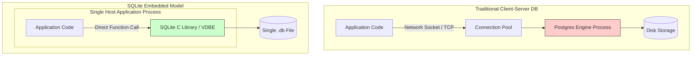
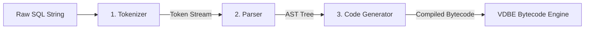
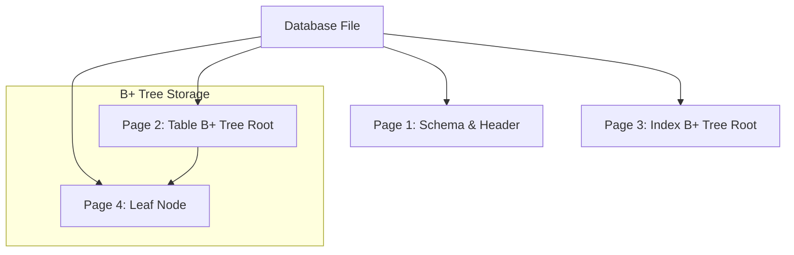
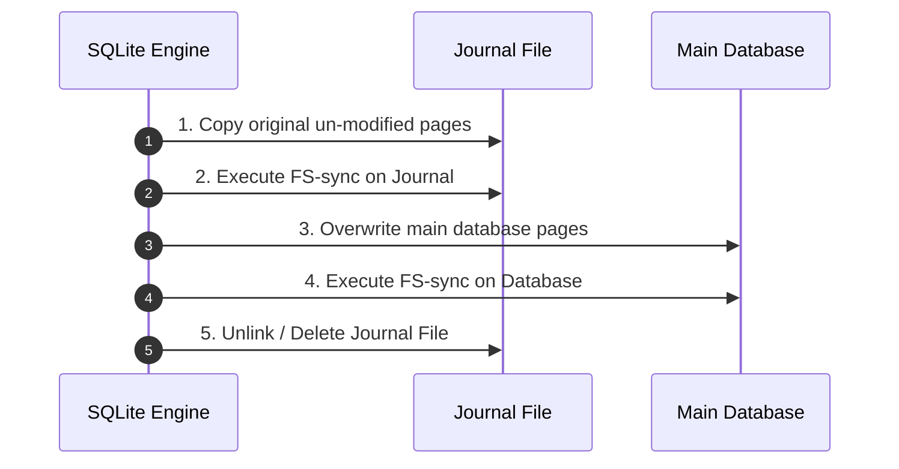
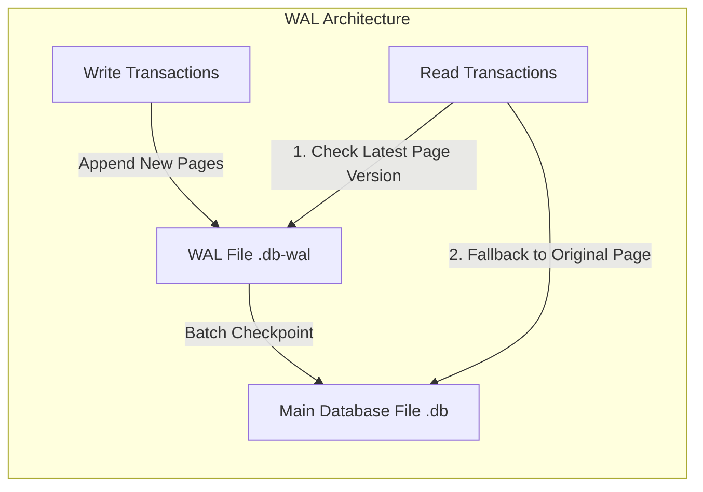

# How SQLite Packs a Full RDBMS into a Single File

[SQLite](https://www.sqlite.org/) is the most widely deployed database engine on the planet. It powers operating system state inside smartphones, runs telemetry logic in flight avionics, and operates on embedded satellites. 

While traditional enterprise systems rely on Postgres or MySQL instances listening on network ports, SQLite completely eliminates server boundaries. It packs a fully ACID-compliant relational engine into a zero-configuration, single-file C library embedded directly inside your application process.

Let's peek under the hood of [SQLite's architecture](https://www.sqlite.org/arch.html) to see how it parses queries into custom virtual bytecode, balances disk I/O with flat B+ trees, and guarantees crash safety without server overhead.

---

### Step 1: The Process Architecture (In-Process vs. Client-Server)

In a conventional client-server database architecture, executing a query involves network serialization over TCP sockets, context switching between process boundaries, and managing dedicated connection pools.



SQLite replaces this entire client-server boundary with direct link-level embedding via its [C/C++ Interface](https://www.sqlite.org/c3ref/intro.html):

* **Zero Network Overhead:** Queries execute as direct function calls inside your host process stack. There are no socket read timeouts or connection pool leaks.
* **Single-File File System Abstraction:** Tables, indexes, schemas, and dirty pages are serialized into a single binary file on disk. You can back up, clone, or ship an entire database state by copying a single file.

---

### Step 2: Compiling SQL into Virtual Machine Bytecode

SQLite does not execute SQL declaratively at runtime. Instead, it compiles incoming SQL strings into a sequence of procedural instructions executed by an internal register-based virtual machine known as the [Virtual Database Engine (VDBE)](https://www.sqlite.org/vdbe.html).



The parsing phase converts raw string queries into executable step-by-step operations:

1. **[Tokenizer](https://www.sqlite.org/arch.html#tokenizer):** Splits raw strings into structured lexical tokens.
2. **[Parser](https://www.sqlite.org/arch.html%23parser):** Uses a Lemon LALR parser generator to build an Abstract Syntax Tree (AST) and validate SQL grammar.
3. **[Code Generator](https://www.sqlite.org/arch.html%23code_generator):** Compiles the validated AST down to VDBE bytecode assembly.

You can inspect this compiled bytecode directly by prepending the [`EXPLAIN`](https://www.sqlite.org/lang_explain.html) keyword to any valid SQL statement:

```sql
EXPLAIN SELECT name FROM users WHERE id = 42;

```

Instead of high-level declarative logic, the engine outputs explicit procedural [VDBE opcodes](https://www.sqlite.org/opcode.html):

| Addr | Opcode | P1 | P2 | P3 | P4 | Comment |
| --- | --- | --- | --- | --- | --- | --- |
| 0 | `Init` | 0 | 7 | 0 |  | Start execution |
| 1 | `OpenRead` | 0 | 2 | 0 | 2 | Open table cursor at root page 2 |
| 2 | `SeekRowid` | 0 | 6 | 1 |  | Seek cursor to rowid 42 |
| 3 | `Column` | 0 | 1 | 2 |  | Extract 'name' column into register r2 |
| 4 | `ResultRow` | 2 | 1 | 0 |  | Output register r2 payload |
| 5 | `Halt` | 0 | 0 | 0 |  | Terminate process |

---

### Step 3: Storage Layout (Pages and B+ Trees)

Everything beneath the VDBE layer drops relational abstractions and operates exclusively on fixed-size binary structures managed by the [Pager and B-Tree module](https://sqlite.org/arch.html).



The underlying disk layer is organized around three strict performance invariants:

* **Fixed Page Sizes:** The database file is chunked into uniform pages (typically $4096$ bytes). Pages act as the absolute atomic unit for all physical disk reads and writes.
* **B+ Tree Table Layout:** Tables are stored as B+ trees sorted by an internal 64-bit integer (`rowid`). Leaf nodes hold the complete row payload, while internal non-leaf nodes contain only search keys and child page pointers.
* **Index Dual-Walks:** Secondary indexes are stored as separate B-trees mapping indexed column values directly to target `rowid` values. Executing an index lookup requires two sequential tree traversals: walking the index B-tree to resolve the `rowid`, and walking the primary table B+ tree to retrieve the full record.

Because B+ tree nodes hold hundreds of keys per 4KB page block, branching factors remain wide. A dataset containing millions of rows rarely exceeds 3 or 4 levels in tree depth, allowing lookups to resolve with minimal physical disk access.

---

### Step 4: Transaction Safety & Write-Ahead Logging (WAL)

Modifying multi-page B-trees introduces crash-consistency hazards. If power cuts mid-write, partial disk writes will permanently corrupt page references. SQLite guarantees strict [Atomic Commit](https://www.sqlite.org/atomiccommit.html) behavior using one of two concurrency modes.

#### Mode 1: Rollback Journaling (Legacy Default)

Before modifying any original page inside the primary database file, SQLite creates a secondary `.db-journal` file and writes copies of the unmodified target pages into it.



* **The Recovery Path:** If a crash occurs at step 3, SQLite detects the leftover journal file on boot and immediately rewinds the main file pages back to their pre-transaction state.
* **The Lock Constraint:** Rollback journaling requires exclusive file locking. Readers and writers actively block one another from accessing the database file during active write cycles.

#### Mode 2: Write-Ahead Logging ([WAL Mode](https://www.sqlite.org/wal.html))

Modern high-concurrency applications leverage Write-Ahead Logging (`WAL` mode). Instead of overwriting main database file pages, new updates are appended sequentially to a separate `.db-wal` file.



WAL mode fundamentally shifts concurrency limits:

* **Non-Blocking Reads:** Readers query the WAL index to fetch modified pages, while falling back to the main file for unmodified historical pages. Readers never block writers, and writers never block readers.
* **Batch Checkpointing:** SQLite periodically consolidates accumulated WAL log pages back into the primary database file in a single batched sequence once the log crosses defined limits (typically 1,000 pages).

---

### Step 5: Trade-offs & Concurrency Limits

While SQLite offers exceptional read latencies and operational efficiency, its execution model introduces explicit system trade-offs:

* **Single-Writer Constraint:** Even under WAL mode, SQLite enforces an exclusive write-lock lock at the database level. Only one write transaction can execute across the entire database at any given instant.
* **Network Drives & Distributed Access:** Mounting a single SQLite database file over networked filesystems (like NFS or SMB) can break file-locking primitives, leading to state corruption.
* **Best-Fit Boundary:** SQLite is designed to replace direct local disk writes, key-value stores, or embedded file formats—it is not built to handle horizontally scaled write workloads across multi-node server clusters.

---

### Summary

SQLite achieves its efficiency through targeted design decisions:

* **In-Process Virtual Machine:** SQL statements compile into VDBE bytecode assembly executed locally inside host memory.
* **Page-Based B+ Trees:** Data remains compact in flat 4KB disk blocks, keeping index lookups to minimal page reads.
* **Atomic WAL Buffering:** Writes append safely to separate log buffers, allowing non-blocking reads and crash resiliency without database management overhead.
