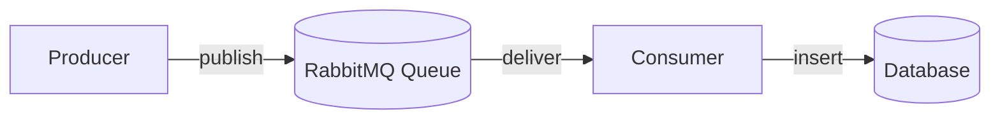
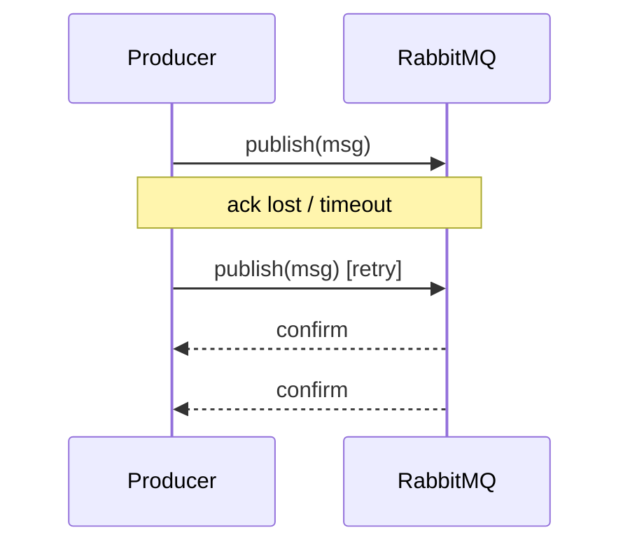
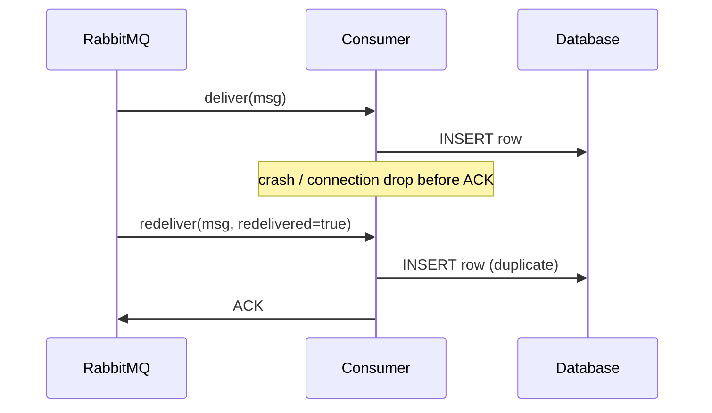
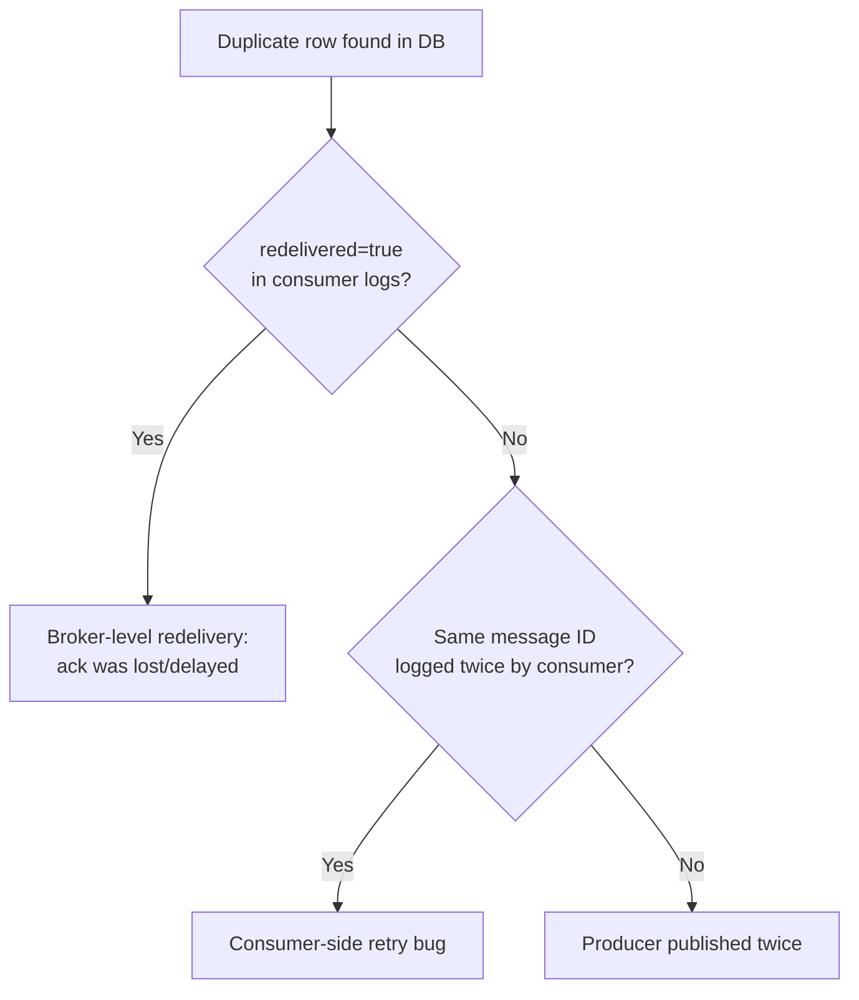

# How to Debug Duplicate DB Records in a RabbitMQ System

Duplicate rows showing up in a database fed by a [RabbitMQ](https://www.rabbitmq.com/docs) consumer is one of the most common issues in distributed, message-driven systems. The tricky part is that when you first spot the duplicates, you usually have no idea *where* in the pipeline they were introduced - the producer, the broker, or the consumer could all be the culprit. This post walks through a systematic way to narrow it down.

## The Pipeline

A typical setup looks like this:

Duplication can be introduced at any of the three hops: **A → B**, **B → C**, or **C → D**. Since all you can observe at first is "there are two identical-looking rows in the DB," the investigation has to work backward from the symptom to the cause.

## Step 1: Characterize the Duplicates Before Touching Any Code

Before writing debug code, look closely at the duplicate rows themselves. A few questions answer a surprising amount:

- Are the rows **byte-for-byte identical**, or do fields like `created_at` differ slightly?
- Does the payload contain a **message ID** or natural key you can compare across the duplicate rows?
- What's the **time gap** between the two inserts - milliseconds (suggesting a retry storm) or minutes/hours (suggesting redelivery after a crash or restart)?
- Are duplicates **clustered** around deploys, consumer restarts, or network blips, or spread evenly over time?

This alone often narrows the search space considerably.

## Step 2: Narrow Down Where in the Pipeline It Happens

### A. Producer side - duplicate publish

If the producer uses [publisher confirms](https://www.rabbitmq.com/docs/confirms) incorrectly, or retries a publish after a timeout without knowing whether the first attempt actually succeeded, the same logical message can be published twice.

### B. Broker-level - message redelivery

This is the most frequent cause in practice. The consumer processes a message but the [acknowledgement](https://www.rabbitmq.com/docs/confirms#consumer-acknowledgements) is lost, delayed, or never sent (e.g., the consumer crashes right after processing but before acking). RabbitMQ, having received no ack, redelivers the message.

RabbitMQ sets a [`redelivered` flag](https://www.rabbitmq.com/docs/consumers#message-properties) on any message it redelivers. Logging this flag on every message your consumer receives is one of the highest-signal debugging steps available - if `redelivered=true` correlates with the timestamps of your duplicate rows, you've found your root cause.

### C. Consumer/DB level - non-idempotent writes

Even with no broker-level redelivery, duplicates can come from the consumer itself:

- Internal retry logic on a transient DB error, without deduplication.
- Multiple consumer instances (horizontal scaling) processing overlapping messages due to a prefetch or acking bug.
- An insert that isn't idempotent - no unique constraint, no upsert - so any redelivery, from any cause, becomes a new row.

## Step 3: Instrument to Catch It Live

Since the root cause isn't known upfront, add correlation IDs across the pipeline:

- Log every message the consumer receives, along with its message ID, the `redelivered` flag, the [delivery tag](https://www.rabbitmq.com/docs/confirms), the consumer instance ID, and a timestamp.
- Log every DB write with that same message ID.
- When a duplicate shows up in the database, join these logs by message ID to see whether RabbitMQ delivered the message twice, or delivered it once but the consumer wrote it twice.

## Step 4: Structural Fixes, Regardless of Root Cause

Once you've identified - or even while you're still narrowing down - the root cause, these changes make the system resilient to duplication in general:

1. **Add a unique constraint** in the database on the message ID or a natural key, so duplicate inserts fail loudly (and get logged) instead of silently creating extra rows.
2. **Make the consumer idempotent** - use an upsert or "insert if not exists" keyed on message ID. This fixes the symptom no matter which of the three stages caused it.
3. **Ack after the DB commit succeeds, not before or on receipt.** Acking too early is a classic way to lose messages on crash; acking too late (or on receipt) is a classic way to get spurious redeliveries. See RabbitMQ's [consumer acknowledgement modes](https://www.rabbitmq.com/docs/confirms#consumer-acknowledgement-modes) for the tradeoffs.

## Summary

Debugging duplicate DB records fed by a queue is fundamentally a process of elimination across three possible failure points: the producer, the broker, and the consumer. Start by inspecting the duplicate data itself for clues, then instrument the `redelivered` flag and message IDs at the consumer boundary, correlate those logs with your DB writes, and - regardless of what you find - make the consumer idempotent as a defensive baseline. That combination of systematic narrowing and idempotent design is what turns "there are mystery duplicates in prod" into a fully explained, fixed issue.