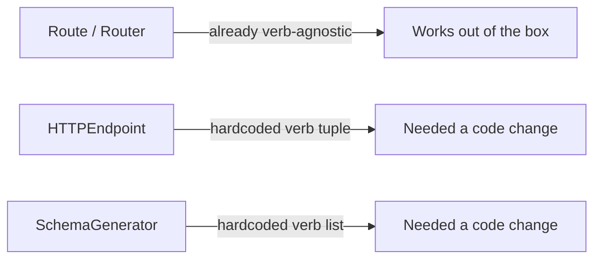
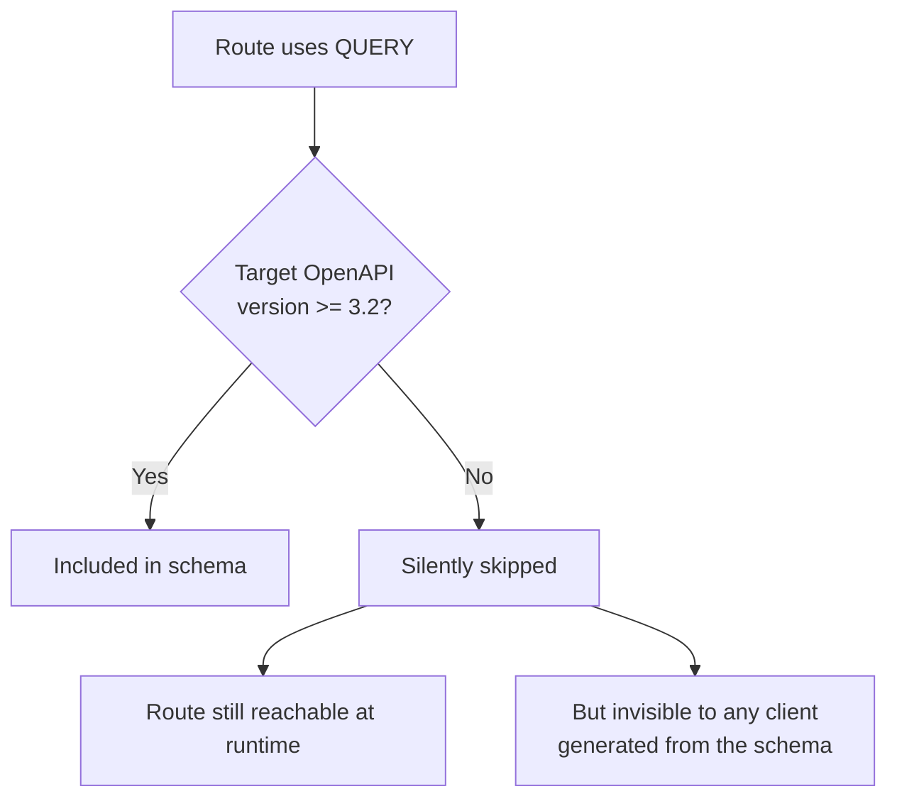

# Adding the QUERY HTTP Method to Starlette

[RFC 10008](https://www.rfc-editor.org/rfc/rfc10008) recently standardized a new HTTP method: `QUERY`. It behaves like `GET` - safe, no side effects, idempotent - but unlike `GET`, it carries a request body. That makes it a good fit for complex search/filter requests that don't fit cleanly into a query string.

This post walks through what it took to add `QUERY` support to [Starlette](https://www.starlette.dev/), merged in [PR #3489](https://github.com/Kludex/starlette/pull/3489) and shipped in [Starlette 1.7.0](https://github.com/Kludex/starlette/releases/tag/1.7.0).

## Why This Was a Small Change

Starlette's router doesn't hardcode a fixed list of HTTP verbs. `Route.matches()` just checks whether the incoming method is in whatever list you passed to `methods=[...]`:

```python
Route("/search", search_endpoint, methods=["QUERY"])
```

That line worked *before* any of this PR existed. The real work wasn't teaching the router a new verb - it was finding the handful of places that **do** assume a fixed, closed set of verbs, and opening them up.



## Where the Hardcoded Lists Lived

**`starlette/endpoints.py`** - `HTTPEndpoint` builds its list of allowed methods by checking, for each known verb, whether the class defines a matching lowercase method:

```python
self._allowed_methods = [
    method
    for method in ("GET", "HEAD", "POST", "PUT", "PATCH", "DELETE", "OPTIONS", "QUERY")
    if getattr(self, method.lower(), None) is not None
]
```

Adding `"QUERY"` here means a class can now define `async def query(self, request):` and have it dispatch correctly, with the right `Allow` header on a 405.

**`starlette/schemas.py`** - `SchemaGenerator` iterates a similar fixed list when introspecting class-based endpoints for OpenAPI generation:

```python
for method in ["get", "post", "put", "patch", "delete", "options", "query"]:
    if not hasattr(route.endpoint, method):
        continue
    ...
```

## The One Subtlety: OpenAPI Version Gating

`QUERY` as an OpenAPI operation is only formally defined starting with [**OpenAPI 3.2**](https://www.openapis.org/blog/2025/09/23/announcing-openapi-v3-2). Emitting a `query` path item into an older 3.0/3.1 schema would produce a non-conformant document. So the schema generator checks the target version before including it:

```python
openapi_version_match = re.match(r"^(\d+)\.(\d+)", str(schema.get("openapi", "")))
supports_query = (
    openapi_version_match is not None
    and tuple(map(int, openapi_version_match.groups())) >= (3, 2)
)

for endpoint in endpoints_info:
    if endpoint.http_method == "query" and not supports_query:
        continue
    ...
```

If you generate a schema with `"openapi": "3.0.0"`, `query` routes are silently skipped rather than emitted incorrectly. Generate with `"openapi": "3.2.0"` and they show up as expected.

## Testing the Change

Coverage needed to hit three surfaces:

1. A plain function-based route with `methods=["QUERY"]` - confirms routing needed zero changes.
2. An `HTTPEndpoint` subclass with a `.query()` handler - confirms dispatch and the `Allow` header.
3. Schema generation at both `< 3.2` and `>= 3.2` - confirms the version gate works in both directions.

```python
def test_router_query_method(client):
    response = client.request("QUERY", "/search")
    assert response.status_code == 200

    response = client.get("/search")
    assert response.status_code == 405
    assert response.headers["allow"] == "QUERY"
```

## A Gap Found After Shipping: The Silent Skip

> **Note:** Everything in this section is still just an idea from a conversation - nothing here has been solved, no branch has been opened, and no code has been written yet.

After the release went out, this whole idea came out of a reply thread on [Fosstodon](https://fosstodon.org/@kg/117336726257346701) (Mastodon), not from my own testing or a bug report. A reader pointed out that the version gate above protects the generated *document* from being non-conformant, but it does that by silently dropping the route from the schema entirely. The endpoint itself keeps answering `QUERY` requests just fine - it's only the OpenAPI document that goes quiet about it.



That's a real gap: a client generated from a 3.0/3.1 schema has no way to know the route exists at all. The reachable surface of the API and the documented surface quietly diverge, and nothing tells you it happened.

The proposed fix is small - a `warnings.warn()` at the exact point the route is skipped, so the person generating the schema gets a signal instead of silence:

```python
import warnings

for endpoint in endpoints_info:
    if endpoint.http_method == "query" and not supports_query:
        warnings.warn(
            f"Route '{endpoint.path}' uses the QUERY method, but the target "
            f"OpenAPI version ({schema.get('openapi')}) does not support it "
            f"(requires >= 3.2). The route will be omitted from the generated "
            f"schema, even though it remains reachable.",
            UserWarning,
            stacklevel=2,
        )
        continue
    ...
```

To be clear: this is still just an idea born entirely out of that Mastodon thread. I haven't opened a branch, haven't written any code, and haven't even opened the Starlette discussion for it yet - it needs one first, same as the original `QUERY` proposal, since it's a (small) behavior change to an existing method rather than a pure addition. But it's a good example of how a shipped feature keeps getting sharper after release, purely through public conversation: the version gate closed one correctness gap (non-conformant schemas), and a stranger on the internet immediately spotted the next one (silent invisibility) it opened up - before a single line of fix code existed.

## What's Next

Starlette is the routing layer underneath [FastAPI](https://fastapi.tiangolo.com/), so this unblocks a follow-up: adding a matching `@app.query(...)` decorator there, plus making sure FastAPI's OpenAPI and body-parsing logic treats `QUERY` as body-bearing (like `POST`), not body-less (like `GET`). That's the next piece of this work - alongside the warning-on-skip idea above.

## Summary

Adding a new HTTP method to a mature framework usually isn't one big change - it's finding the small number of places that quietly assumed the set of methods was closed, and opening each one deliberately. Starlette's router was already open-ended; `HTTPEndpoint` and `SchemaGenerator` weren't, and now they are, with the OpenAPI version gate keeping generated schemas honest about which spec version actually supports `QUERY`. And as the Fosstodon thread showed, "honest about the spec" and "honest about what's reachable" turned out to be two different problems.

<meta name="fediverse:creator" content="@kg@fosstodon.org">
