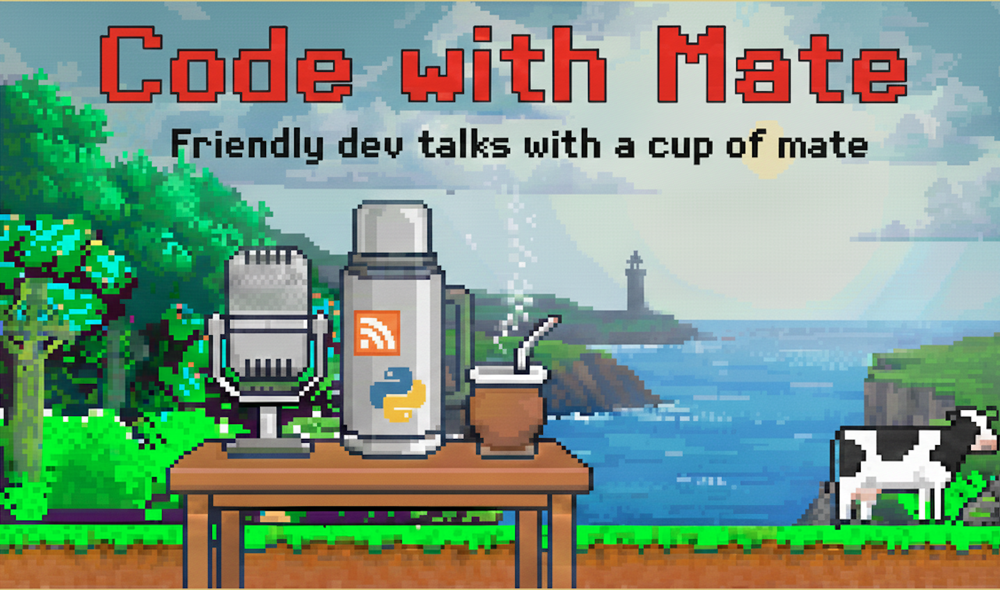

# Podcast



Welcome to **Code with Mate** - friendly software engineering talks with a cup of mate.  <br/>

### Subscribe to the Podcast

[](https://kfir-g.dev/podcast/feed.xml){:target="_blank"}

You can subscribe to my podcast using this RSS link:

```bash
https://kfir-g.dev/podcast/feed.xml
```

If your podcast app (not include Spotify) allows adding an RSS feed manually, this is the easiest way to follow new episodes.

Not sure how to add an RSS feed?  
These step-by-step guides (with screenshots) will show you exactly how:

- **How to manually add an RSS feed to any podcast app**  
  [https://www.thepitch.show/blog/how-to-manually-add-an-rss-feed-to-your-podcast-app-on-desktop-ios-android/](https://www.thepitch.show/blog/how-to-manually-add-an-rss-feed-to-your-podcast-app-on-desktop-ios-android/)

- **How to add a podcast using an RSS link (multiple apps supported)**  
  [https://transistor.fm/add-podcast/](https://transistor.fm/add-podcast/)

Adding the feed above is the **minimum step needed** to start listening. Give it a try!


## Episodes

### [Episode 4 - Roberto J. García Navarro](episodes/episode4-roberto.md)
**Date:** 2026-01-25

Episode 4 features Roberto J. García Navarro — Senior Backend Engineer. We talk about how a junior developer can grow into a backend architect, using Roberto’s real career path as a blueprint. We dive into Python, Go, event-driven architecture, and how to make good architectural decisions in real-world systems. A practical, honest conversation about career growth, system design, and learning what actually matters — with mate on the side.

### [Episode 3- Dev Diary: Building TinyURL in Production](episodes/episode3-tinyurl.md)
**Date:** 2025-12-21

Episode 3 takes you behind the scenes of building TinyURL — a URL shortener deployed in a production environment. We cover the full journey from designing the FastAPI backend and PostgreSQL database to implementing Redis caching and configuring Nginx as a reverse proxy. I share the challenges of CI/CD pipelines, SSL setup, and deploying with Gunicorn, as well as the lessons learned about distributed systems, caching strategies, and scaling web services. This episode gives a hands-on view of turning code into a reliable, real-world web application.


### [Episode 2 - Martín Torre Castro](episodes/episode2-martin.md)
**Date:** 2025-12-13

Episode 2 features Martín Torre Castro — software architect, performance engineer, and Python Coruña community lead. We talk about performance testing in real systems, software architecture in practice, Python communities in Spain, and lessons learned from building and scaling production systems.


### [Episode 1 - Ssali Jonathan](episodes/episode1-jod35.md)
**Date:** 2025-11-30  

Episode 1 kicks off with Ssali Jonathan — software engineer and open-source enthusiast. We talk about his journey in tech, his content creation, and Python web frameworks. Topics include FastAPI, Starlette, databases, Redis, and learning as a software engineer.

